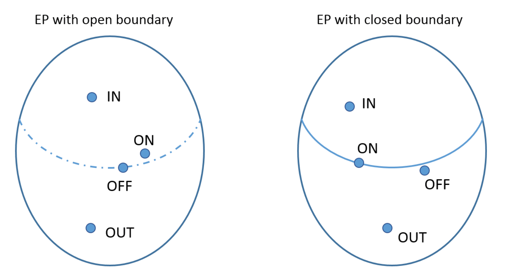

# Internal Representation

### Predicates
A predicate is an expression that evaluates to a Boolean value. Predicates contain Boolean variables, True or False values, or non-Boolean variables with <, >, &le;, &ge;, =, &ne; or Boolean function calls. An atomic predicate is called a clause that contains a single logical condition like  *"x > 1"*.

## Boundary Value Analysis
Boundary testing is the process of testing between the boundaries between partitions of the input values. From each predicate, we can create an interval, on which we can determine the data points that are necessary for testing thoroughly.

To cover all the cases, we have the following data points defined both in an open and closed boiunaries. We always have to have to determine the smallest unit, which will serve as the scale for our model. We call it *precision*. (For example for natural numbers, it would be 1.) This helps us to create an ordering between the data points.

An **ON** point refers to the first accepted data point on a boundary. If we have an interval, we have two on points: the first accepted data point from each end. 

An **ININ** point refers to the second accepted data point on a boundary. If we have an interval, we have two on points: the second accepted data point from each end. 

An **IN** point refers to an accepted value, that is different from the first accepted data point on a boundary. If we have an interval, then this is different from the first accepted data point from each end. 

An **OFF** point refers to the first not accepted data point on a boundary. If we have an interval, we have two on points: the first not accepted data point from each end. 

An **OUT** point refers to an not accepted value, that is different from the first accepted data point on a boundary. If we have an interval, then this is different from the first not accepted data point from each end.

